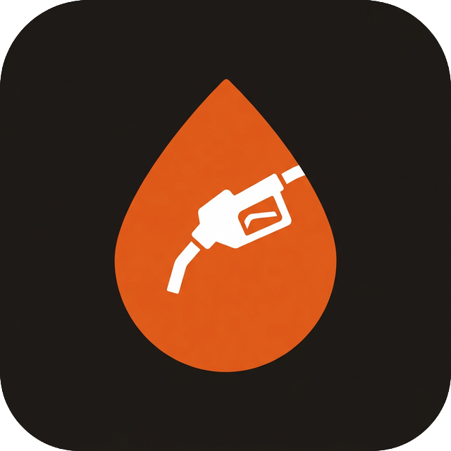

<p align="center">
  
</p>

# FuelDrop

[](https://github.com/dhaatrik/fueldrop/actions)


FuelDrop is a cutting-edge, React-powered fuel delivery platform that redefines how users refuel their vehicles. By bridging the gap between fuel stations and consumers, it offers an on-demand service that is both convenient and transparent.

## 🚀 The Problem & Solution

**The Problem:** Traditional refueling often involves long wait times, inconvenient detours, and lack of real-time tracking for businesses managing multiple vehicles.

**The Solution:** FuelDrop brings the fuel station to the user. Whether it's a single car at home or a fleet at a warehouse, FuelDrop provides a seamless ordering experience with real-time tracking, secure authentication, and comprehensive order history.

---

## 📋 Table of Contents

- [Features](#-features)
- [Tech Stack](#-tech-stack)
- [Getting Started](#-getting-started)
  - [Prerequisites](#prerequisites)
  - [Installation](#installation)
- [Usage Guide](#-usage-guide)
- [Captain Guide](#-captain-guide)
- [Project Structure](#-project-structure)
- [Contributing](#-contributing)
- [Testing](#-testing)
- [License](#-license)

---

## ✨ Features

### Core Experience
- **🔐 Secure Authentication**: Mobile-first OTP verification (simulated) for user security.
- **🚗 Vehicle Garage**: Add and manage profiles for multiple vehicles with fuel type, tank capacity, and daily usage tracking.
- **⛽ Smart Ordering**: Precise ordering by volume (liters) or value (rupees) with dynamic pricing and auto-selection for single-vehicle users.
- **📍 Real-time Tracking**: Live delivery status updates, captain assignment, and ETA tracking.
- **📊 Order Insights**: Comprehensive history of past and ongoing deliveries with filters & search.
- **❤️ Favorite Orders**: Save and quickly reorder your most common fuel deliveries.
- **👨‍✈️ Captain Dashboard**: Dedicated interface for delivery partners to manage and fulfill orders.
- **🌙 Dark Mode**: Full light/dark theme support with a neo-brutalist design system.
- **📱 Mobile-First Design**: Fully responsive UI built for the modern mobile user.

### Advanced Features
- **🚨 Emergency Refill**: Priority dispatch toggle with +₹150 surge fee, skipping the queue and alerting captains with a visual badge.
- **📝 Delivery Instructions**: Free-text field (200 chars) for access notes like "Park near Pillar 4B" — visible to captains throughout the delivery.
- **🎁 Promo Code Discovery**: A "View Available Offers" bottom sheet in checkout so users never miss a discount (e.g., FIRST50).
- **⏱️ Modification Grace Period**: 60-second countdown after placing an order to edit or undo before a captain picks it up.
- **🔮 Predictive Refill Reminders**: Smart reminders on the home screen based on tank capacity and daily driving patterns.
- **🚐 Fleet Mode**: Dedicated bulk ordering page (`/fleet`) to refuel multiple vehicles in a single checkout.
- **🗺️ Navigate in Maps**: Captain can open Google Maps with one tap for turn-by-turn directions to the customer.
- **🌿 Impact Gamification**: Post-delivery screen showing time saved, CO₂ avoided, and total deliveries completed.
- **⭐ Captain Rating**: Rate your delivery captain and leave tips after each order.

---

## 🛠 Tech Stack

| Technology | Purpose | Why? |
| :--- | :--- | :--- |
| **React 19** | UI Framework | Leverages the latest concurrent rendering features for a smooth UX. |
| **TypeScript** | Language | Ensures type safety and improves developer productivity. |
| **Vite** | Build Tool | Provides near-instant Hot Module Replacement (HMR) and optimized builds. |
| **Tailwind CSS 4** | Styling | Utility-first approach for rapid, consistent, and responsive UI development. |
| **Motion** | Animation | Adds fluid, premium micro-animations to improve user engagement. |
| **Lucide React** | Icons | A beautiful and consistent icon set for modern interfaces. |

---

## 🏁 Getting Started

### Prerequisites

- **Node.js**: Version 22.0 or higher (LTS recommended)
- **Package Manager**: npm (v10+) or yarn
- **Browser**: Modern evergreen browser (Chrome, Edge, Firefox, Safari)

### Installation

1. **Clone the repository**
   ```bash
   git clone https://github.com/dhaatrik/fueldrop.git
   cd fueldrop
   ```

2. **Install dependencies**
   ```bash
   npm install
   ```

3. **Launch Development Server**
   ```bash
   npm run dev
   ```
   Open [http://localhost:3000](http://localhost:3000) to view the application.

---

## 📖 Usage Guide

### User Journey: Refueling Made Simple

Follow these steps to get fuel delivered to your doorstep:

1. **Secure Login**: Enter your mobile number and authenticate using the test OTP `1234`.
2. **Add Your Fleet**: Navigate to the **Garage** to add your vehicles. Optionally set **tank capacity** and **avg daily km** to get smart refill reminders on the home screen.
3. **Place an Order**: 
    - If you have only one vehicle, it's **auto-selected** for you.
    - Choose your fuel type (Petrol/Diesel).
    - Specify quantity by **Volume** (Liters) or **Value** (Rupees).
    - Toggle **🚨 Emergency Refill** for priority dispatch (+₹150 surge).
    - Add optional **delivery instructions** for the captain.
4. **Fleet Mode**: Need to refuel multiple vehicles? Use the **Fleet** button on the home screen to place a bulk order.
5. **Instant Checkout**: Review transparent pricing. Tap **"View Available Offers"** to discover and apply promo codes like `FIRST50`.
6. **Live Tracking**: Once a Captain accepts, track their progress in real-time. During the first **60 seconds**, you can tap **"Edit Order"** to modify your order.
7. **Completion & Feedback**: After delivery, rate your experience and view your impact — **time saved**, **CO₂ avoided**, and **total deliveries**.

---

## 👨‍✈️ Captain Guide

### Fulfilling Orders

The Captain App is a dedicated interface for our delivery partners to manage their workflow.

**Accessing the Captain App:**
Navigate to `http://localhost:3000/captain` to access the Captain Dashboard. This route is publicly accessible for testing and demonstration purposes.

**Captain Workflow:**
1.  **Dashboard Overview**: View available orders with fuel type, quantity, distance, and any **⚡ Emergency Priority** badges.
2.  **Accepting Orders**: Tap **"Accept Order"** to claim a delivery. Look for **delivery instructions** from the customer (e.g., gate codes, parking notes).
3.  **Navigate in Maps**: Tap the **"Navigate in Maps"** button to open Google Maps with turn-by-turn directions to the customer.
4.  **Status Management**: Update the order status as you progress:
    - **Pick Up**: Mark when you've reached the station.
    - **In Transit**: Mark when you are on your way to the user.
    - **Arrived**: Notify the user when you've reached the delivery location.
5.  **Order Completion**: Finalize the delivery once the fuel is dispensed.
6.  **Earnings Tracking**: (Coming Soon) Track your daily earnings and completed trips.

---

## 🤝 Contributing

We love contributions! Whether it's a bug fix, a new feature, or improved documentation, satisfy your curiosity by helping us build FuelDrop.

1. **Fork** the project.
2. **Create** your feature branch (`git checkout -b feature/AmazingFeature`).
3. **Commit** your changes (`git commit -m 'Add some AmazingFeature'`).
4. **Push** to the branch (`git push origin feature/AmazingFeature`).
5. **Open** a Pull Request.

Please adhere to our [Code of Conduct](https://www.contributor-covenant.org/version/2/1/code_of_conduct/code_of_conduct.md).

---

## 🧪 Testing

Maintain high code quality by running our validation suite:

```bash
# Run TypeScript type-checking
npm run lint

# Verify the production build
npm run build

# Run unit tests
npm test
```

---

## 📄 License

This project is licensed under the **MIT License**. See the [LICENSE](LICENSE) file for the full text.

---

<p align="center">
  Built with ❤️ by Dhaatrik Chowdhury
</p>
